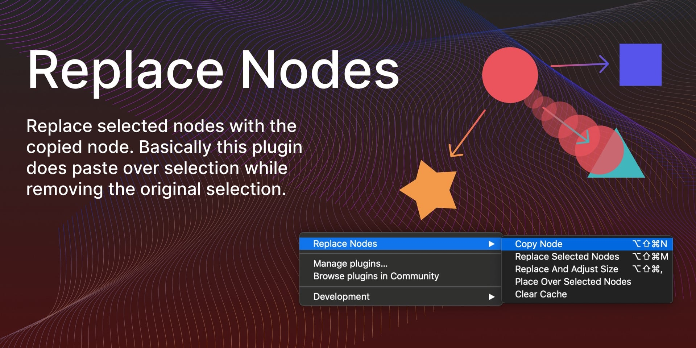

# Replace Nodes (Figma Plugin)

Replace Nodes plugin replaces selected nodes with the copied node. Basically this plugin does paste over selection while removing the original selection.

How to use:
1. Select one node 
2. Right click -> Plugins -> Replace Nodes -> Copy Node
3. Select one or multiple nodes for replacement
4. Right click -> Plugins -> Replace Nodes -> Replace Selected Nodes or Replace And Adjust Size

Version 3 on February 22, 2021
- added "Replace And Adjust Size" and "Place Over Selected Nodes"

Version 2 on May 22, 2020
- keeps same layer position after replacing